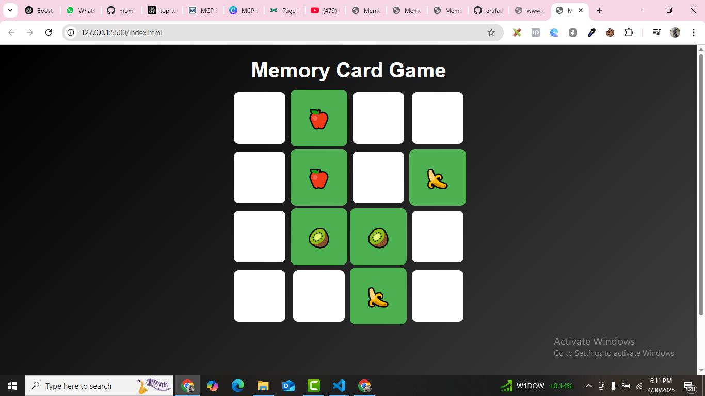

# Memory Card Game

A beautiful and interactive memory card game built with HTML, CSS, and JavaScript. The game features a modern UI, smooth animations, and responsive design.

## Features

- **Dynamic Gameplay**: Flip cards to find matching pairs.
- **Responsive Design**: Works seamlessly on all devices.
- **Modern UI**: Beautiful gradients, hover effects, and animations.
- **Play Again**: Restart the game with a single click.

## How to Play

1. Open the `index.html` file in your browser.
2. Click on two cards to flip them.
3. Match all pairs to win the game.
4. Click the "Play Again" button to restart.

## Technologies Used

- **HTML**: Structure of the game.
- **CSS**: Styling and animations.
- **JavaScript**: Game logic and interactivity.

## Screenshots

## License

This project is open-source and available under the [MIT License](LICENSE).